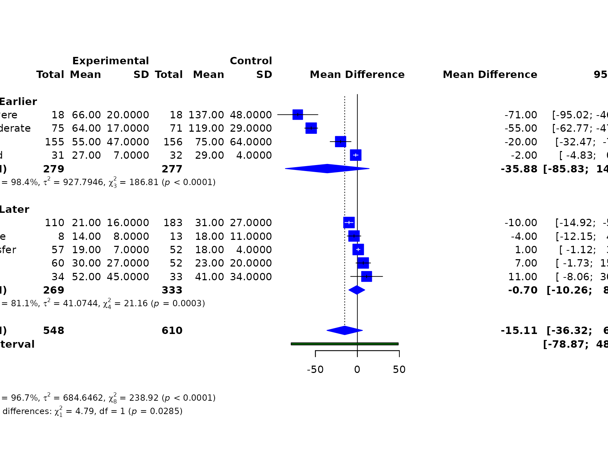
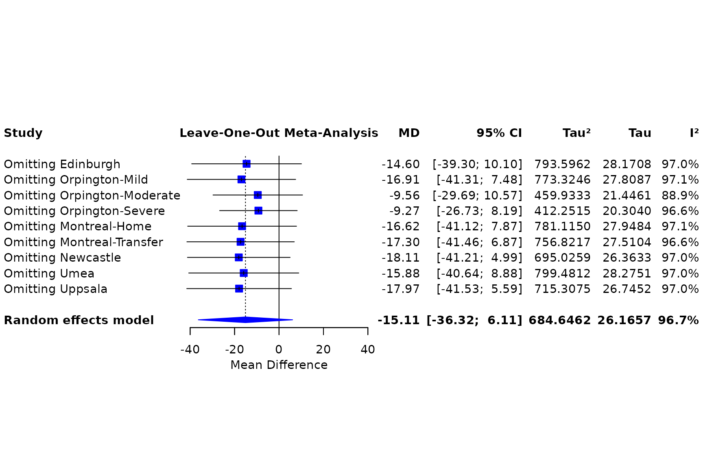
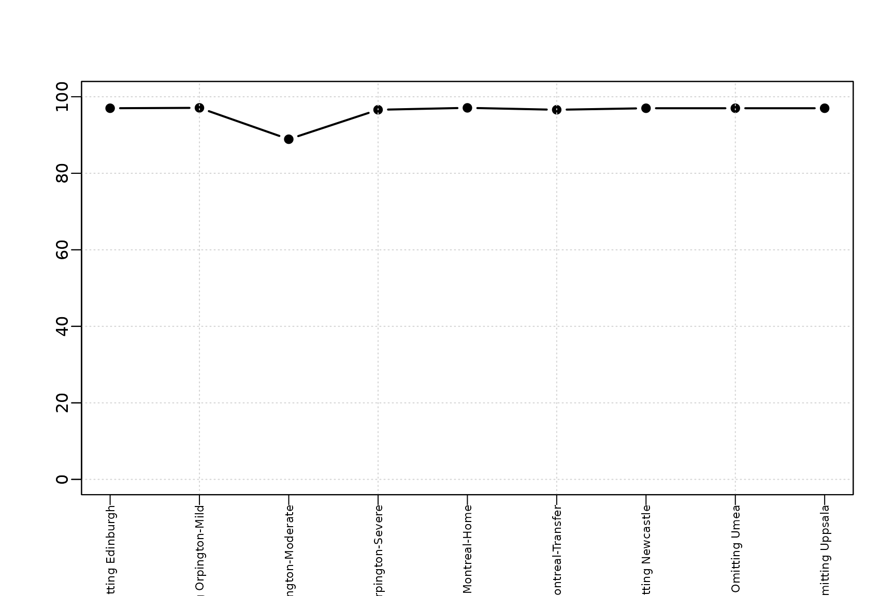
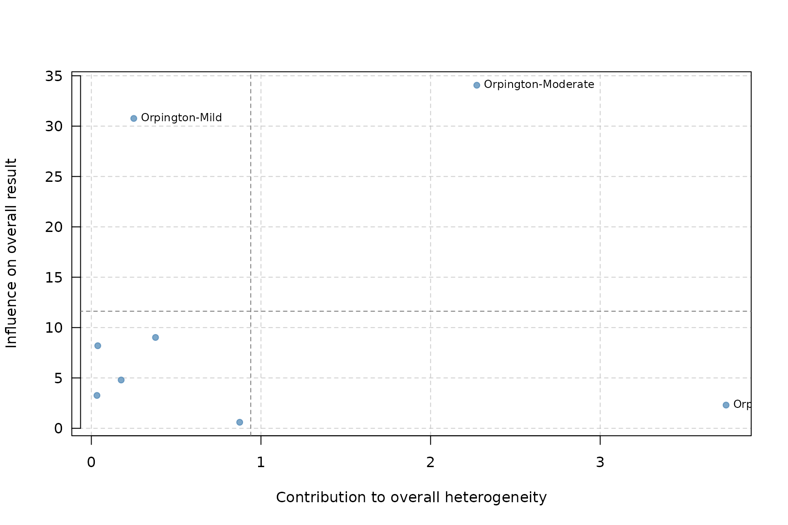
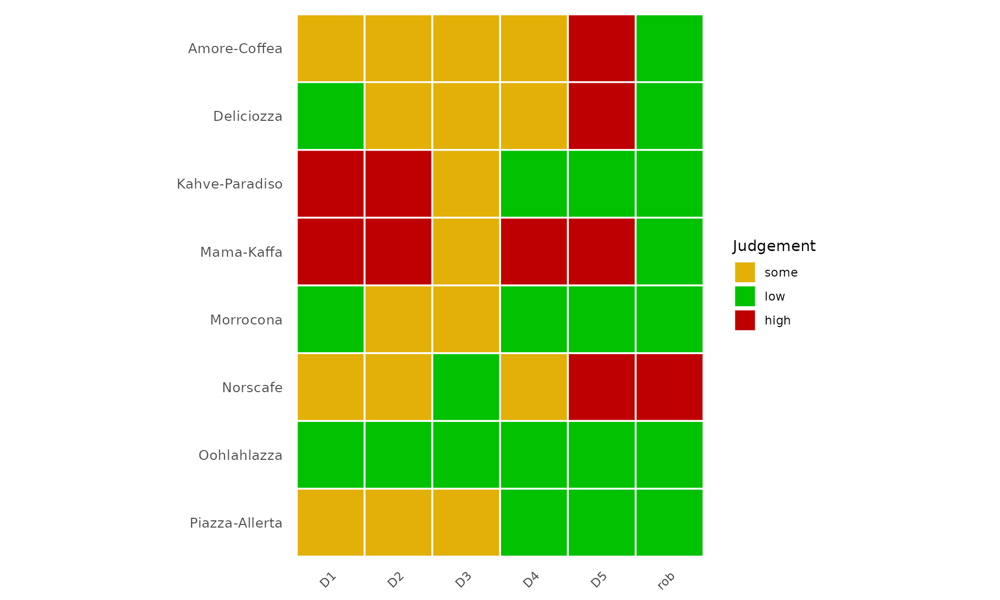
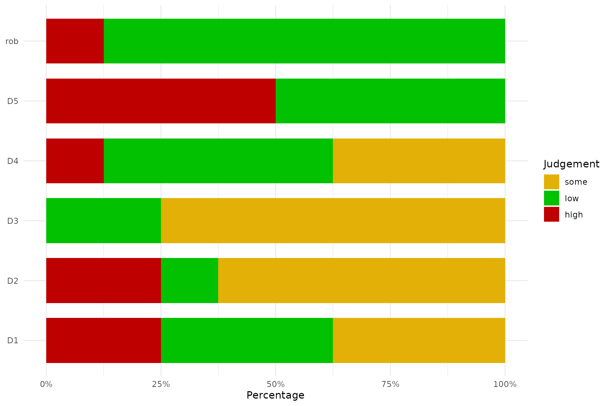

# Case study: Continuous outcomes and study appraisal

This case study demonstrates continuous-outcome meta-analysis and then
uses a second bundled dataset to show risk-of-bias visualisation.

``` r

library(metapropul)
data("dat_normand1999", package = "metapropul")
dat_normand1999$period <- ifelse(
  seq_len(nrow(dat_normand1999)) <= 4, "Earlier", "Later"
)
```

## Mean difference and subgroup analysis

``` r

mean_md <- meta_mean(
  dat_normand1999,
  mean.e = "m1i", sd.e = "sd1i", n.e = "n1i",
  mean.c = "m2i", sd.c = "sd2i", n.c = "n2i",
  studylab = "source", subgroup = "period",
  measure = "MD", model = "random", ci_method = "HK"
)
summary(mean_md)
#> 
#> Meta-analysis Summary
#> ----------------------
#> Number of studies: 9
#> Total observations: 1,158 (548 experimental, 610 control)
#> 
#> Pooled MD = -15.11 (95% CI: -36.32, 6.11)
#> Prediction interval: -78.87 – 48.66
#> p-value = 0.139
#> Q = 238.92 (df = 8), p < 0.001
#> I² = 96.7%
#> Tau² = 684.6462
#> 
#> Subgroup results
#> ----------------
#> Earlier: -35.88 (95% CI: -85.83, 14.06), Tau² = 927.7946, I² = 98.4%
#> Later: -0.70 (95% CI: -10.26, 8.86), Tau² = 41.0744, I² = 81.1%
#> 
#> Test for subgroup differences (random): Q = 4.79, df = 1, p = 0.029
#> 
#> Notes
#> -----
#>   - Continuous outcomes pooled as MD.
#>   - I² quantifies the proportion of total observed variability attributable
#>   to between-study heterogeneity rather than sampling error.
#>   - However, I² increases with study precision and may approach 100% even
#>   when Tau² remains unchanged.
#>   - Therefore, I² should not be used alone to judge heterogeneity or decide
#>   whether studies should be pooled.
#>   - Tau² represents the variance of true effects across studies and is
#>   generally more informative than I² for judging the magnitude of
#>   heterogeneity.
#>   - High I² observed. Interpret cautiously because I² may be inflated in
#>   large or highly precise studies.
#>   - The prediction interval shows the range of effects expected in a new
#>   study and helps assess clinical relevance.
#>   - Confidence interval method for random-effects model: HK.
#>   - The subgroup-difference test assesses whether pooled effects differ
#>   between subgroup levels; a non-significant result does not prove the
#>   subgroups are equivalent.
#>   - Subgroup-specific prediction intervals are not shown in this summary.
#>   - Decisions to pool studies should be based on clinical relevance, not
#>   solely on statistical heterogeneity.
#> 
#> For study-level results: object$table
mean_md$meta.subgroup.summary
#> # A tibble: 2 × 6
#>   Subgroup Estimate lower upper  Tau2    I2
#>   <chr>       <dbl> <dbl> <dbl> <dbl> <dbl>
#> 1 Earlier   -35.9   -85.8 14.1  928.   98.4
#> 2 Later      -0.699 -10.3  8.86  41.1  81.1
```

A fixed-effect standardised mean difference provides a sensitivity
analysis on a common scale.

``` r

mean_smd <- meta_mean(
  dat_normand1999, "m1i", "sd1i", "n1i", "m2i", "sd2i", "n2i",
  studylab = "source", subgroup = "period",
  measure = "SMD", model = "fixed"
)
summary(mean_smd)
#> 
#> Meta-analysis Summary
#> ----------------------
#> Number of studies: 9
#> Total observations: 1,158 (548 experimental, 610 control)
#> 
#> Pooled SMD = -0.41 (95% CI: -0.53, -0.29)
#> p-value < 0.001
#> Q = 122.42 (df = 8), p < 0.001
#> I² = 93.5%
#> Tau² = 0.7887
#> 
#> Subgroup results
#> ----------------
#> Earlier: -0.79 (95% CI: -0.96, -0.61), Tau² = 1.0087, I² = 96.0%
#> Later: -0.09 (95% CI: -0.26, 0.07), Tau² = 0.0930, I² = 74.9%
#> 
#> Test for subgroup differences (common): Q = 31.32, df = 1, p < 0.001
#> 
#> Notes
#> -----
#>   - Continuous outcomes pooled as SMD.
#>   - I² quantifies the proportion of total observed variability attributable
#>   to between-study heterogeneity rather than sampling error.
#>   - However, I² increases with study precision and may approach 100% even
#>   when Tau² remains unchanged.
#>   - Therefore, I² should not be used alone to judge heterogeneity or decide
#>   whether studies should be pooled.
#>   - Tau² represents the variance of true effects across studies and is
#>   generally more informative than I² for judging the magnitude of
#>   heterogeneity.
#>   - High I² observed. Interpret cautiously because I² may be inflated in
#>   large or highly precise studies.
#>   - Common-effect model used; Tau² is reported descriptively but not used for
#>   weighting.
#>   - The subgroup-difference test assesses whether pooled effects differ
#>   between subgroup levels; a non-significant result does not prove the
#>   subgroups are equivalent.
#>   - Subgroup-specific prediction intervals are not shown in this summary.
#>   - Decisions to pool studies should be based on clinical relevance, not
#>   solely on statistical heterogeneity.
#> 
#> For study-level results: object$table
```

``` r

render_gt(table_meta(mean_md, title = "Continuous-outcome meta-analysis"))
```

| Continuous-outcome meta-analysis |  |  |  |  |
|:---|:---|---:|---:|:---|
| Study | Mean (SD) | Total | Weight (%) | Mean Difference \[95% CI\] |
| Edinburgh | 55 (47) vs 75 (64) | 311 | 11.0 | -20 \[-32.47 – -7.53\] |
| Orpington-Mild | 27 (7) vs 29 (4) | 63 | 11.7 | -2 \[-4.83 – 0.83\] |
| Orpington-Moderate | 64 (17) vs 119 (29) | 146 | 11.4 | -55 \[-62.77 – -47.23\] |
| Orpington-Severe | 66 (20) vs 137 (48) | 36 | 9.6 | -71 \[-95.02 – -46.98\] |
| Montreal-Home | 14 (8) vs 18 (11) | 21 | 11.4 | -4 \[-12.15 – 4.15\] |
| Montreal-Transfer | 19 (7) vs 18 (4) | 109 | 11.7 | 1 \[-1.12 – 3.12\] |
| Newcastle | 52 (45) vs 41 (34) | 67 | 10.3 | 11 \[-8.06 – 30.06\] |
| Umea | 21 (16) vs 31 (27) | 293 | 11.6 | -10 \[-14.92 – -5.08\] |
| Uppsala | 30 (27) vs 23 (20) | 112 | 11.4 | 7 \[-1.73 – 15.73\] |
| Pooled |  | NA | NA | -15.11 \[-36.32 – 6.11\] (I² = 96.7%)¹ |
| ¹ I² = proportion of total observed variability attributable to between-study heterogeneity. Not a significance test; magnitude depends on study precision and number of studies. |  |  |  |  |

``` r

forest_meta(mean_md)
```



## Influence and cumulative analyses

``` r

render_gt(table_influence(mean_md))
```

| Study | Estimate \[95% CI\] | I² (% variability)¹ | Tau² |
|:---|:---|---:|---:|
| Omitting Edinburgh | -14.6 \[-39.3 – 10.1\] | 97.0 | 793.5962 |
| Omitting Orpington-Mild | -16.91 \[-41.31 – 7.48\] | 97.1 | 773.3246 |
| Omitting Orpington-Moderate | -9.56 \[-29.69 – 10.57\] | 88.9 | 459.9333 |
| Omitting Orpington-Severe | -9.27 \[-26.73 – 8.19\] | 96.6 | 412.2515 |
| Omitting Montreal-Home | -16.62 \[-41.12 – 7.87\] | 97.1 | 781.1150 |
| Omitting Montreal-Transfer | -17.3 \[-41.46 – 6.87\] | 96.6 | 756.8217 |
| Omitting Newcastle | -18.11 \[-41.21 – 4.99\] | 97.0 | 695.0259 |
| Omitting Umea | -15.88 \[-40.64 – 8.88\] | 97.0 | 799.4812 |
| Omitting Uppsala | -17.97 \[-41.53 – 5.59\] | 97.0 | 715.3075 |
| ¹ I² = proportion of total observed variability attributable to between-study heterogeneity. Not a significance test; magnitude depends on study precision and number of studies. |  |  |  |

``` r

forest_influence(mean_md)
```



``` r

render_gt(table_cumulative_meta(mean_md))
```

| Step | Study | Estimate \[95% CI\] | I² (% variability)¹ | Tau² |
|---:|:---|:---|---:|---:|
| 1 | Adding Edinburgh (k=1) | -20 \[-32.5 – -7.53\] | NA | NA |
| 2 | Adding Orpington-Mild (k=2) | -9.93 \[-123 – 104\] | 86.9 | 140.7057 |
| 3 | Adding Orpington-Moderate (k=3) | -25.6 \[-92.9 – 41.7\] | 98.8 | 723.7250 |
| 4 | Adding Orpington-Severe (k=4) | -35.9 \[-85.8 – 14.1\] | 98.4 | 927.7946 |
| 5 | Adding Montreal-Home (k=5) | -29.3 \[-67.3 – 8.79\] | 97.9 | 876.0678 |
| 6 | Adding Montreal-Transfer (k=6) | -24 \[-55.5 – 7.53\] | 97.8 | 837.5764 |
| 7 | Adding Newcastle (k=7) | -19.3 \[-47.4 – 8.87\] | 97.4 | 846.9858 |
| 8 | Adding Umea (k=8) | -18 \[-41.5 – 5.59\] | 97.0 | 715.3075 |
| 9 | Adding Uppsala (k=9) | -15.1 \[-36.3 – 6.11\] | 96.7 | 684.6462 |
| ¹ I² = proportion of total observed variability attributable to between-study heterogeneity. Not a significance test; magnitude depends on study precision and number of studies. |  |  |  |  |

``` r

forest_cumulative(mean_md)
```


## Heterogeneity and DOI assessment

``` r

plot_heterogeneity(mean_md)
```



``` r

plot_baujat(mean_md)
```



There are fewer than ten studies, so this example uses the DOI plot
rather than treating funnel-asymmetry tests as reliable.

``` r

doi_plot(mean_md)
```


## Risk-of-bias figures

The bundled caffeine dataset contains five domain judgements and an
overall judgement. The labels are passed as a custom appraisal scheme so
the example uses exactly the levels present in the source data.

``` r

data("caffeine", package = "metapropul")
domains <- c("D1", "D2", "D3", "D4", "D5", "rob")
judgements <- unique(unlist(caffeine[domains], use.names = FALSE))
judgements <- judgements[!is.na(judgements)]
```

``` r

plot_rob(
  caffeine, "study", tool = "Custom",
  domains = domains, levels = judgements
)
```



``` r

plot_rob_summary(
  caffeine, "study", tool = "Custom",
  domains = domains, levels = judgements
)
```



Risk-of-bias judgements should inform interpretation and sensitivity
analysis; they are not statistical weights and should not be converted
mechanically into quality scores.
