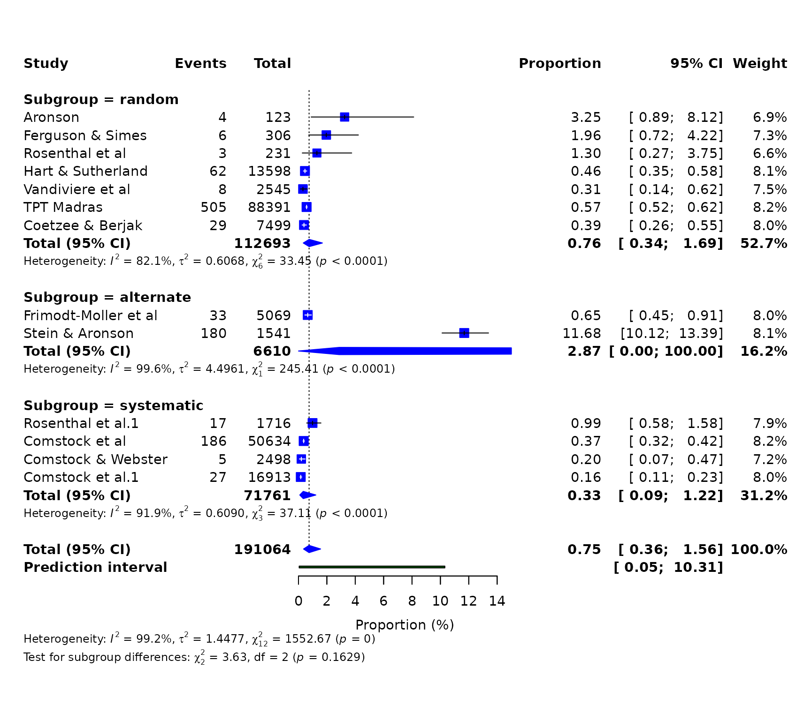
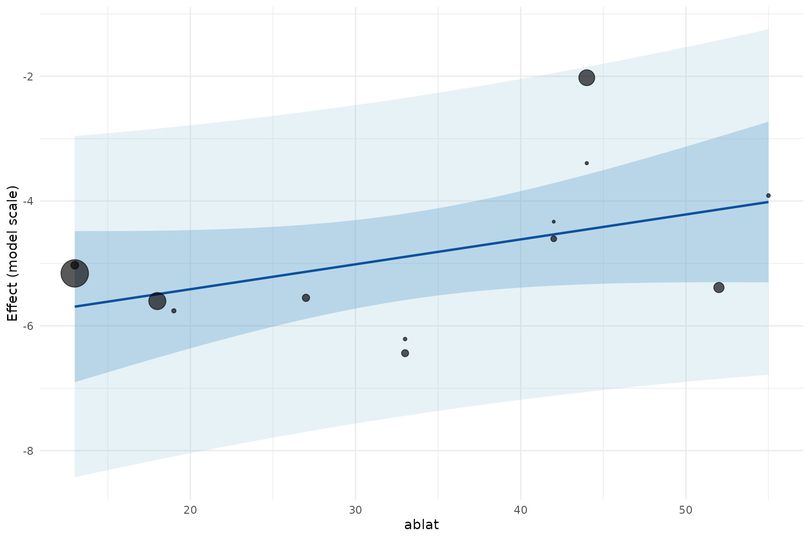
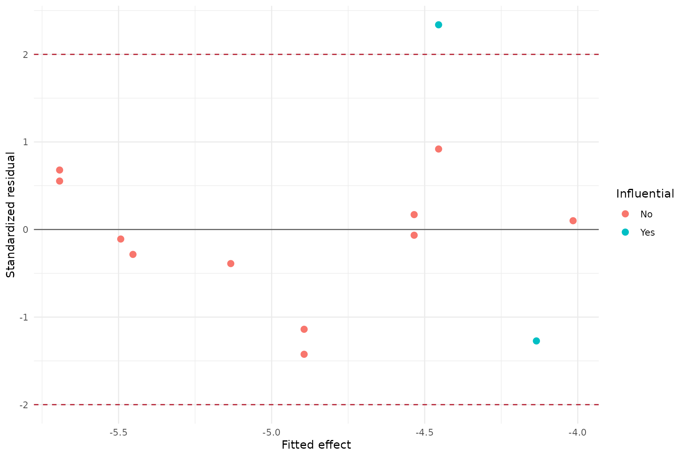
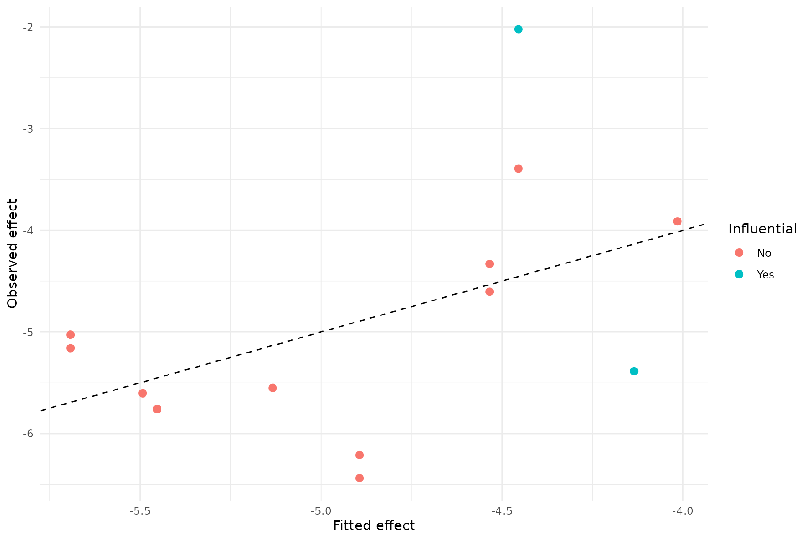
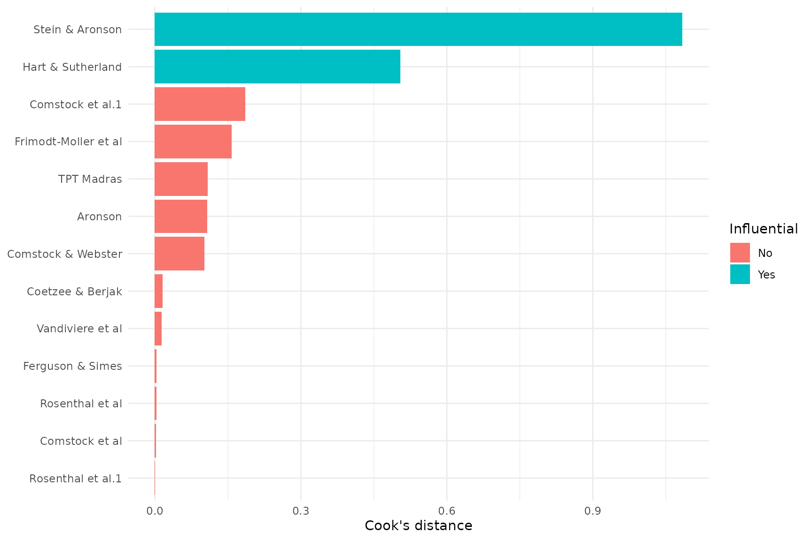

# Case study: Tuberculosis proportions and meta-regression

This case study estimates tuberculosis event proportions in BCG study
arms and then investigates latitude as a moderator. It demonstrates
single-proportion transformations and the complete meta-regression
workflow.

``` r

library(metapropul)
data("dat_bcg", package = "metapropul")
```

## Proportion meta-analysis and subgroups

``` r

prop_logit <- meta_prop(
  dat_bcg, event = "tpos", n = "npos",
  studylab = "author", subgroup = "alloc",
  sm = "PLOGIT", model = "random", ci_method = "HK"
)
summary(prop_logit)
#> 
#> Meta-analysis Summary
#> ----------------------
#> Number of studies: 13
#> 
#> Pooled proportion = 0.7% (95% CI: 0.4%, 1.6%)
#> Prediction interval: 0.0% – 10.3%
#> Q = 1552.67 (df = 12), p < 0.001
#> I² = 99.2%
#> Tau² = 1.4477
#> 
#> Subgroup results
#> ----------------
#> random: 0.76 (95% CI: 0.34, 1.69), Tau² = 0.6068, I² = 82.1%
#> alternate: 2.87 (95% CI: 0.00, 100.00), Tau² = 4.4961, I² = 99.6%
#> systematic: 0.33 (95% CI: 0.09, 1.22), Tau² = 0.6090, I² = 91.9%
#> 
#> Test for subgroup differences (random): Q = 3.63, df = 2, p = 0.163
#> 
#> Notes
#> -----
#>   - Proportions pooled using logit transformation and back-transformed to
#>   percentages.
#>   - p-value omitted for pooled proportions; focus on the confidence interval
#>   and prediction interval.
#>   - I² quantifies the proportion of total observed variability attributable
#>   to between-study heterogeneity rather than sampling error.
#>   - However, I² increases with study precision and may approach 100% even
#>   when Tau² remains unchanged.
#>   - Therefore, I² should not be used alone to judge heterogeneity or decide
#>   whether studies should be pooled.
#>   - Tau² represents the variance of true effects across studies and is
#>   generally more informative than I² for judging the magnitude of
#>   heterogeneity.
#>   - High I² observed. Interpret cautiously because I² may be inflated in
#>   large or highly precise studies.
#>   - The prediction interval shows the range of effects expected in a new
#>   study and helps assess clinical relevance.
#>   - Confidence interval method for random-effects model: HK.
#>   - The subgroup-difference test assesses whether pooled effects differ
#>   between subgroup levels; a non-significant result does not prove the
#>   subgroups are equivalent.
#>   - Subgroup-specific prediction intervals are not shown in this summary.
#>   - Decisions to pool studies should be based on clinical relevance, not
#>   solely on statistical heterogeneity.
#> 
#> For study-level results: object$table
prop_logit$meta.subgroup.summary
#> # A tibble: 3 × 6
#>   Subgroup   Estimate        lower  upper  Tau2    I2
#>   <chr>         <dbl>        <dbl>  <dbl> <dbl> <dbl>
#> 1 random        0.756 0.337          1.69 0.607  82.1
#> 2 alternate     2.87  0.0000000151 100.0  4.50   99.6
#> 3 systematic    0.335 0.0910         1.22 0.609  91.9
```

The Freeman–Tukey option is retained for compatibility, but its
back-transformation can be difficult to interpret and can behave poorly
when study sizes differ. It is shown below only as a sensitivity
analysis; logit or GLMM approaches are generally preferable for the
primary analysis.

``` r

prop_pft <- meta_prop(
  dat_bcg, "tpos", "npos", studylab = "author",
  subgroup = "alloc", sm = "PFT", model = "fixed"
)
summary(prop_pft)
#> 
#> Meta-analysis Summary
#> ----------------------
#> Number of studies: 13
#> 
#> Pooled proportion = 0.1% (95% CI: 0.1%, 0.1%)
#> Q = 603.89 (df = 12), p < 0.001
#> I² = 98.0%
#> Tau² = 0.0069
#> 
#> Subgroup results
#> ----------------
#> random: 0.14 (95% CI: 0.13, 0.15), Tau² = 0.0010, I² = 75.9%
#> alternate: 0.52 (95% CI: 0.43, 0.61), Tau² = 0.0358, I² = 99.7%
#> systematic: 0.08 (95% CI: 0.07, 0.09), Tau² = 0.0006, I² = 91.6%
#> 
#> Test for subgroup differences (common): Q = 203.96, df = 2, p < 0.001
#> 
#> Notes
#> -----
#>   - Proportions pooled using Freeman-Tukey double arcsine transformation and
#>   back-transformed to percentages.
#>   - PFT may be useful when proportions are close to 0 or 1.
#>   - p-value omitted for pooled proportions; focus on the confidence interval
#>   and prediction interval.
#>   - I² quantifies the proportion of total observed variability attributable
#>   to between-study heterogeneity rather than sampling error.
#>   - However, I² increases with study precision and may approach 100% even
#>   when Tau² remains unchanged.
#>   - Therefore, I² should not be used alone to judge heterogeneity or decide
#>   whether studies should be pooled.
#>   - Tau² represents the variance of true effects across studies and is
#>   generally more informative than I² for judging the magnitude of
#>   heterogeneity.
#>   - High I² observed. Interpret cautiously because I² may be inflated in
#>   large or highly precise studies.
#>   - Common-effect model used; Tau² is reported descriptively but not used for
#>   weighting.
#>   - The subgroup-difference test assesses whether pooled effects differ
#>   between subgroup levels; a non-significant result does not prove the
#>   subgroups are equivalent.
#>   - Subgroup-specific prediction intervals are not shown in this summary.
#>   - Decisions to pool studies should be based on clinical relevance, not
#>   solely on statistical heterogeneity.
#> 
#> For study-level results: object$table
```

``` r

render_gt(table_meta(prop_logit, title = "Tuberculosis events in BCG study arms"))
```

| Tuberculosis events in BCG study arms |  |  |  |  |
|:---|---:|---:|---:|:---|
| Study | Events | Total | Weight (%) | Proportion \[95% CI\] |
| Aronson | 4 | 123 | 6.9 | 3.3% \[0.9 – 8.1\] |
| Ferguson & Simes | 6 | 306 | 7.3 | 2% \[0.7 – 4.2\] |
| Rosenthal et al | 3 | 231 | 6.6 | 1.3% \[0.3 – 3.7\] |
| Hart & Sutherland | 62 | 13598 | 8.1 | 0.5% \[0.3 – 0.6\] |
| Frimodt-Moller et al | 33 | 5069 | 8.0 | 0.7% \[0.4 – 0.9\] |
| Stein & Aronson | 180 | 1541 | 8.1 | 11.7% \[10.1 – 13.4\] |
| Vandiviere et al | 8 | 2545 | 7.5 | 0.3% \[0.1 – 0.6\] |
| TPT Madras | 505 | 88391 | 8.2 | 0.6% \[0.5 – 0.6\] |
| Coetzee & Berjak | 29 | 7499 | 8.0 | 0.4% \[0.3 – 0.6\] |
| Rosenthal et al.1 | 17 | 1716 | 7.9 | 1% \[0.6 – 1.6\] |
| Comstock et al | 186 | 50634 | 8.2 | 0.4% \[0.3 – 0.4\] |
| Comstock & Webster | 5 | 2498 | 7.2 | 0.2% \[0.1 – 0.5\] |
| Comstock et al.1 | 27 | 16913 | 8.0 | 0.2% \[0.1 – 0.2\] |
| Pooled | NA | NA | NA | 0.7% \[0.4 – 1.6\] (I² = 99.2%)¹ |
| ¹ I² = proportion of total observed variability attributable to between-study heterogeneity. Not a significance test; magnitude depends on study precision and number of studies. |  |  |  |  |

``` r

forest_meta(prop_logit)
```



## Univariable meta-regression

Latitude is centred so that the intercept refers to the effect at the
mean latitude. Knapp–Hartung inference is requested explicitly.

``` r

reg_latitude <- meta_reg(
  prop_logit, dat_bcg, ~ ablat,
  studylab = "author", center = "ablat", test = "knha",
  min_studies_per_parameter = 3
)
summary(reg_latitude)
#> 
#> Meta-regression Summary
#> ------------------------
#> # A tibble: 1 × 8
#>   tau2_null  tau2 R2_analog   QE_pval    QM QM_pval k_included k_excluded
#>       <dbl> <dbl>     <dbl>     <dbl> <dbl>   <dbl>      <int>      <int>
#> 1      1.45  1.24      14.3 1.17e-203  3.15   0.104         13          0
#> 
#> Coefficients (model scale):
#> ---------------------------
#>      Term    Estimate     CI.Lower    CI.Upper      p.value
#> 1 intrcpt -4.87544515 -5.568517266 -4.18237303 8.160545e-09
#> 2   ablat  0.03993842 -0.009586665  0.08946351 1.035493e-01
#> 
#> Moderator effects on odds-ratio scale:
#> --------------------------------
#>    Term Estimate  CI.Lower CI.Upper
#> 1 ablat 1.040747 0.9904591 1.093587
#> 
#> Notes
#> -----
#>   - Model-scale estimates are on the logit scale. Exponentiated moderator
#>   coefficients are odds ratios; use predict_meta_reg() for predicted
#>   proportions.
#>   - The intercept is not back-transformed because it is often not
#>   interpretable unless continuous moderators are centered.
#>   - In models with interactions or uncentered continuous moderators, some
#>   coefficient-based back-transformations may be difficult to interpret
#>   because they depend on reference values of other moderators.
#>   - R² analog = 14.3198620690409%: modest proportion of between-study
#>   variance explained.
#>   - QE tests residual heterogeneity after accounting for moderators.
#>   - QM tests whether moderators jointly explain heterogeneity.
#>   - Use object$meta to access the full rma() model.
```

``` r

render_gt(table_meta_reg(reg_latitude))
```

| Term | Estimate \[95% CI\] | p-value | Back-transformed \[95% CI\] |
|:---|:---|---:|:---|
| intrcpt | -4.875 \[-5.569, -4.182\] | 0.000 |  |
| ablat | 0.040 \[-0.010, 0.089\] | 0.104 | 1.041 \[0.990, 1.094\] |
| k = 13; inference = knha; residual tau-squared = 1.2404; R-squared analog = 14.3198620690409% |  |  |  |

## Predicted proportions

``` r

predict_meta_reg(
  reg_latitude,
  newdata = data.frame(ablat = c(10, 30, 50)),
  scale = "response"
)
#> # A tibble: 3 × 7
#>   ablat estimate conf.low conf.high pred.low pred.high scale   
#>   <dbl>    <dbl>    <dbl>     <dbl>    <dbl>     <dbl> <chr>   
#> 1    10    0.298   0.0785      1.12   0.0183      4.65 response
#> 2    30    0.660   0.326       1.33   0.0518      7.86 response
#> 3    50    1.46    0.495       4.20   0.101      17.8  response
```

## Bubble plot with confidence and prediction bands

``` r

plot_meta_reg(reg_latitude, type = "bubble", moderator = "ablat")
```


[`bubble_plot()`](https://drrubesh.github.io/metapropul/reference/bubble_plot.md)
is retained as a convenient wrapper around the same plotting system.

``` r

bubble_plot(reg_latitude, moderator = "ablat")
```



## Residual, fitted-value, and influence diagnostics

``` r

reg_diagnostics <- diagnose_meta_reg(reg_latitude)
reg_diagnostics$collinearity
#> # A tibble: 1 × 3
#>   Term    VIF flagged
#>   <chr> <dbl> <lgl>  
#> 1 ablat     1 FALSE
head(reg_diagnostics$studies)
#> # A tibble: 6 × 11
#>   Study   observed fitted residual standardized_residual cooks_distance leverage
#>   <chr>      <dbl>  <dbl>    <dbl>                 <dbl>          <dbl>    <dbl>
#> 1 Aronson    -3.39  -4.45    1.06                  0.919        0.108     0.110 
#> 2 Fergus…    -3.91  -4.02    0.103                 0.100        0.00314   0.251 
#> 3 Rosent…    -4.33  -4.53    0.204                 0.170        0.00295   0.0913
#> 4 Hart &…    -5.39  -4.14   -1.25                 -1.27         0.505     0.231 
#> 5 Frimod…    -5.03  -5.69    0.665                 0.679        0.158     0.246 
#> 6 Stein …    -2.02  -4.45    2.43                  2.34         1.08      0.132 
#> # ℹ 4 more variables: dffits <dbl>, covariance_ratio <dbl>,
#> #   max_abs_dfbeta <dbl>, influential <lgl>
```

``` r

plot_meta_reg(reg_latitude, type = "residual")
```



``` r

plot_meta_reg(reg_latitude, type = "fitted")
```



``` r

plot_meta_reg(reg_latitude, type = "influence")
```



## Categorical moderators and interactions

The multivariable example fixes the categorical reference level,
standardises latitude, and includes an interaction. With only 13
studies, it is deliberately illustrative and should not be treated as a
well-powered substantive model.

``` r

reg_interaction <- meta_reg(
  prop_logit, dat_bcg, ~ ablat * alloc,
  studylab = "author", reference_levels = c(alloc = "random"),
  scale = "ablat", min_studies_per_parameter = 2
)
summary(reg_interaction)
#> 
#> Meta-regression Summary
#> ------------------------
#> # A tibble: 1 × 8
#>   tau2_null  tau2 R2_analog  QE_pval    QM QM_pval k_included k_excluded
#>       <dbl> <dbl>     <dbl>    <dbl> <dbl>   <dbl>      <int>      <int>
#> 1      1.45 0.638      55.9 1.28e-12  18.7 0.00220         13          0
#> 
#> Coefficients (model scale):
#> ---------------------------
#>                    Term    Estimate   CI.Lower   CI.Upper      p.value
#> 1               intrcpt -4.92037968 -5.5678251 -4.2729343 3.546278e-50
#> 2                 ablat  0.41908438 -0.1759632  1.0141319 1.674704e-01
#> 3        allocalternate  1.87586448  0.5361393  3.2155896 6.063745e-03
#> 4       allocsystematic -0.71527919 -1.7845859  0.3540275 1.898387e-01
#> 5  ablat:allocalternate  0.98088882 -0.2229612  2.1847389 1.102734e-01
#> 6 ablat:allocsystematic -0.03415198 -1.5000035  1.4316996 9.635781e-01
#> 
#> Moderator effects on odds-ratio scale:
#> --------------------------------
#>                    Term  Estimate  CI.Lower  CI.Upper
#> 1                 ablat 1.5205687 0.8386489  2.756969
#> 2        allocalternate 6.5264587 1.7093947 24.917980
#> 3       allocsystematic 0.4890556 0.1678666  1.424794
#> 4  ablat:allocalternate 2.6668255 0.8001459  8.888327
#> 5 ablat:allocsystematic 0.9664246 0.2231294  4.185807
#> 
#> Notes
#> -----
#>   - Model-scale estimates are on the logit scale. Exponentiated moderator
#>   coefficients are odds ratios; use predict_meta_reg() for predicted
#>   proportions.
#>   - The intercept is not back-transformed because it is often not
#>   interpretable unless continuous moderators are centered.
#>   - In models with interactions or uncentered continuous moderators, some
#>   coefficient-based back-transformations may be difficult to interpret
#>   because they depend on reference values of other moderators.
#>   - R² analog = 55.9091720143983%: substantial proportion of between-study
#>   variance explained.
#>   - QE tests residual heterogeneity after accounting for moderators.
#>   - QM tests whether moderators jointly explain heterogeneity.
#>   - Use object$meta to access the full rma() model.
diagnose_meta_reg(reg_interaction)$collinearity
#> # A tibble: 5 × 3
#>   Term                    VIF flagged
#>   <chr>                 <dbl> <lgl>  
#> 1 ablat                  1.55 FALSE  
#> 2 allocalternate         1.18 FALSE  
#> 3 allocsystematic        1.13 FALSE  
#> 4 ablat:allocalternate   1.41 FALSE  
#> 5 ablat:allocsystematic  1.23 FALSE
```
