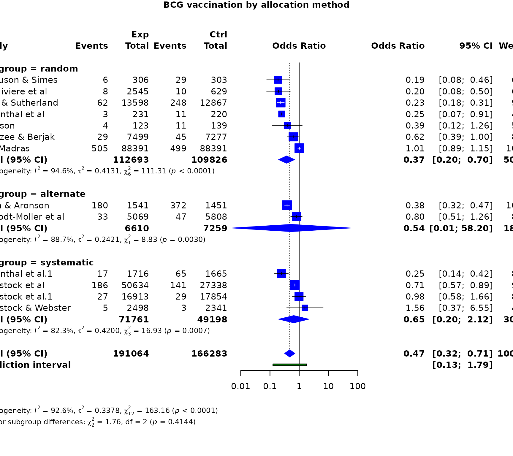
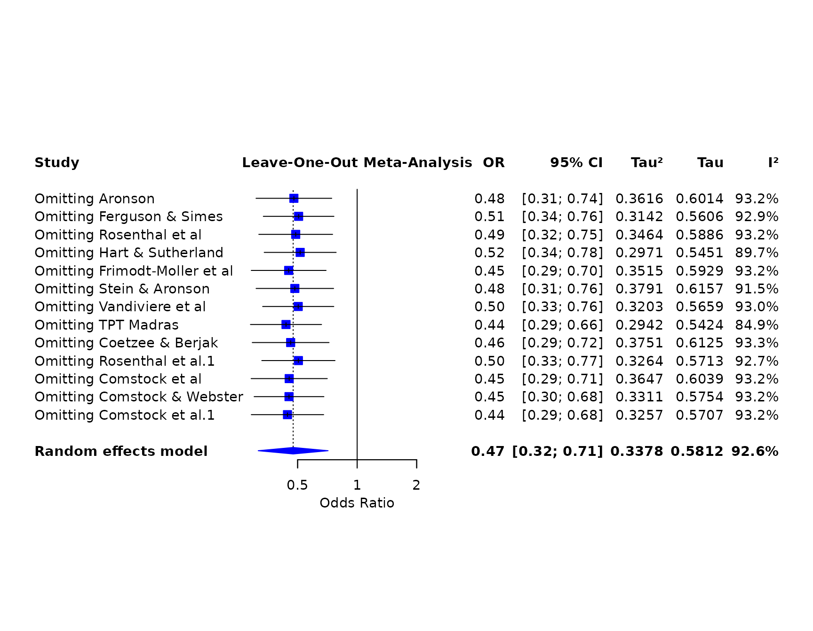
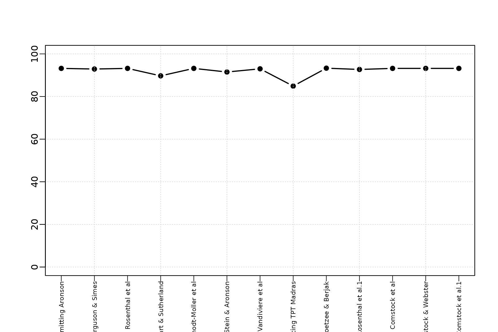
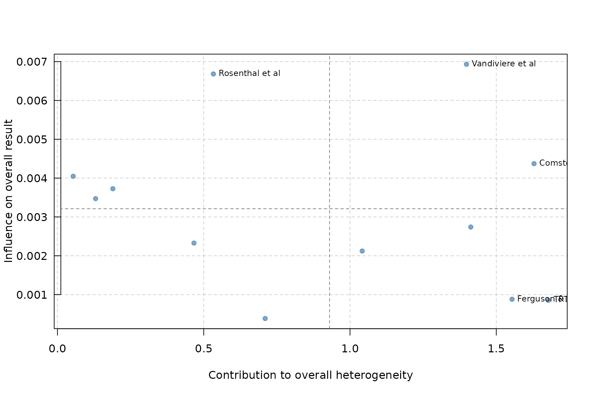
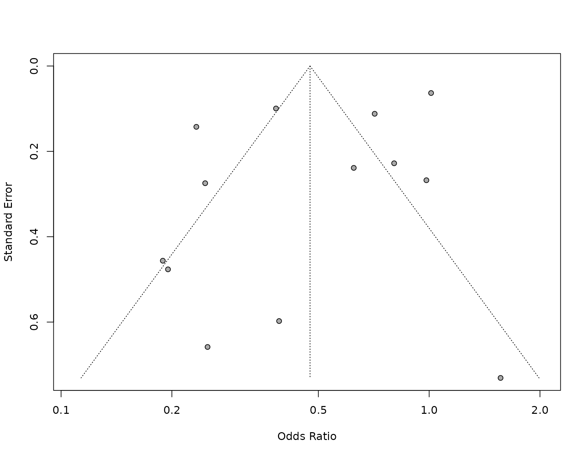

# Case study: BCG vaccine effectiveness

This case study asks whether BCG vaccination reduces tuberculosis and
whether the effect differs by allocation method. It demonstrates the
complete two-group binary-outcome workflow.

``` r

library(metapropul)
data("dat_bcg", package = "metapropul")
dat_bcg$ncon <- dat_bcg$cpos + dat_bcg$cneg
```

## Random-effects odds ratios and subgroups

``` r

bcg_or <- meta_ratio(
  dat_bcg,
  event.e = "tpos", n.e = "npos",
  event.c = "cpos", n.c = "ncon",
  studylab = "author", subgroup = "alloc",
  measure = "OR", model = "random",
  tau_method = "REML", ci_method = "HK"
)
summary(bcg_or)
#> 
#> Meta-analysis Summary
#> ----------------------
#> Number of studies: 13
#> Total observations: 357,347 (191,064 experimental, 166,283 control)
#> Total events: 2,575
#> 
#> Pooled OR = 0.47 (95% CI: 0.32, 0.71)
#> Prediction interval: 0.13 – 1.79
#> p-value = 0.002
#> Q = 163.16 (df = 12), p < 0.001
#> I² = 92.6%
#> Tau² = 0.3378
#> 
#> Subgroup results
#> ----------------
#> random: 0.37 (95% CI: 0.20, 0.70), Tau² = 0.4131, I² = 94.6%
#> alternate: 0.54 (95% CI: 0.01, 58.20), Tau² = 0.2421, I² = 88.7%
#> systematic: 0.65 (95% CI: 0.20, 2.12), Tau² = 0.4200, I² = 82.3%
#> 
#> Test for subgroup differences (random): Q = 1.76, df = 2, p = 0.414
#> 
#> Notes
#> -----
#>   - Pooled OR < 1 indicates lower odds in the experimental group.
#>   - I² quantifies the proportion of total observed variability attributable
#>   to between-study heterogeneity rather than sampling error.
#>   - However, I² increases with study precision and may approach 100% even
#>   when Tau² remains unchanged.
#>   - Therefore, I² should not be used alone to judge heterogeneity or decide
#>   whether studies should be pooled.
#>   - Tau² represents the variance of true effects across studies and is
#>   generally more informative than I² for judging the magnitude of
#>   heterogeneity.
#>   - High I² observed. Interpret cautiously because I² may be inflated in
#>   large or highly precise studies.
#>   - The prediction interval shows the range of effects expected in a new
#>   study and helps assess clinical relevance.
#>   - Confidence interval method for random-effects model: HK.
#>   - The subgroup-difference test assesses whether pooled effects differ
#>   between subgroup levels; a non-significant result does not prove the
#>   subgroups are equivalent.
#>   - Subgroup-specific prediction intervals are not shown in this summary.
#>   - Decisions to pool studies should be based on clinical relevance, not
#>   solely on statistical heterogeneity.
#> 
#> For study-level results: object$table
```

The subgroup rows are reported separately; the subgroup-difference test
should not be interpreted as proof that subgroups are equivalent when
non-significant.

``` r

bcg_or$meta.subgroup.summary
#> # A tibble: 3 × 6
#>   Subgroup   Estimate   lower  upper  Tau2    I2
#>   <chr>         <dbl>   <dbl>  <dbl> <dbl> <dbl>
#> 1 random        0.370 0.196    0.698 0.413  94.6
#> 2 alternate     0.540 0.00500 58.2   0.242  88.7
#> 3 systematic    0.651 0.199    2.12  0.420  82.3
```

For comparison, a fixed-effect risk-ratio analysis uses the same raw
data.

``` r

bcg_rr_fixed <- meta_ratio(
  dat_bcg, "tpos", "npos", "cpos", "ncon",
  studylab = "author", subgroup = "alloc",
  measure = "RR", model = "fixed"
)
summary(bcg_rr_fixed)
#> 
#> Meta-analysis Summary
#> ----------------------
#> Number of studies: 13
#> Total observations: 357,347 (191,064 experimental, 166,283 control)
#> Total events: 2,575
#> 
#> Pooled RR = 0.64 (95% CI: 0.59, 0.69)
#> p-value < 0.001
#> Q = 152.23 (df = 12), p < 0.001
#> I² = 92.1%
#> Tau² = 0.3132
#> 
#> Subgroup results
#> ----------------
#> random: 0.70 (95% CI: 0.64, 0.78), Tau² = 0.3925, I² = 94.6%
#> alternate: 0.49 (95% CI: 0.42, 0.57), Tau² = 0.1326, I² = 82.0%
#> systematic: 0.64 (95% CI: 0.53, 0.77), Tau² = 0.4003, I² = 81.9%
#> 
#> Test for subgroup differences (common): Q = 14.78, df = 2, p < 0.001
#> 
#> Notes
#> -----
#>   - Pooled RR < 1 indicates lower risk in the experimental group.
#>   - I² quantifies the proportion of total observed variability attributable
#>   to between-study heterogeneity rather than sampling error.
#>   - However, I² increases with study precision and may approach 100% even
#>   when Tau² remains unchanged.
#>   - Therefore, I² should not be used alone to judge heterogeneity or decide
#>   whether studies should be pooled.
#>   - Tau² represents the variance of true effects across studies and is
#>   generally more informative than I² for judging the magnitude of
#>   heterogeneity.
#>   - High I² observed. Interpret cautiously because I² may be inflated in
#>   large or highly precise studies.
#>   - Common-effect model used; Tau² is reported descriptively but not used for
#>   weighting.
#>   - The subgroup-difference test assesses whether pooled effects differ
#>   between subgroup levels; a non-significant result does not prove the
#>   subgroups are equivalent.
#>   - Subgroup-specific prediction intervals are not shown in this summary.
#>   - Decisions to pool studies should be based on clinical relevance, not
#>   solely on statistical heterogeneity.
#> 
#> For study-level results: object$table
```

## Main results and forest plot

``` r

render_gt(table_meta(bcg_or, title = "BCG vaccination and tuberculosis"))
```

| BCG vaccination and tuberculosis |  |  |  |
|:---|:---|---:|:---|
| Study | Events | Weight (%) | Odds Ratio \[95% CI\] |
| Aronson | 4/123 vs 11/139 | 5.0 | 0.39 \[0.12 – 1.26\] |
| Ferguson & Simes | 6/306 vs 29/303 | 6.3 | 0.19 \[0.08 – 0.46\] |
| Rosenthal et al | 3/231 vs 11/220 | 4.5 | 0.25 \[0.07 – 0.91\] |
| Hart & Sutherland | 62/13598 vs 248/12867 | 9.7 | 0.23 \[0.18 – 0.31\] |
| Frimodt-Moller et al | 33/5069 vs 47/5808 | 8.9 | 0.8 \[0.51 – 1.26\] |
| Stein & Aronson | 180/1541 vs 372/1451 | 10.0 | 0.38 \[0.32 – 0.47\] |
| Vandiviere et al | 8/2545 vs 10/629 | 6.1 | 0.2 \[0.08 – 0.5\] |
| TPT Madras | 505/88391 vs 499/88391 | 10.1 | 1.01 \[0.89 – 1.15\] |
| Coetzee & Berjak | 29/7499 vs 45/7277 | 8.8 | 0.62 \[0.39 – 1\] |
| Rosenthal et al.1 | 17/1716 vs 65/1665 | 8.4 | 0.25 \[0.14 – 0.42\] |
| Comstock et al | 186/50634 vs 141/27338 | 9.9 | 0.71 \[0.57 – 0.89\] |
| Comstock & Webster | 5/2498 vs 3/2341 | 4.0 | 1.56 \[0.37 – 6.55\] |
| Comstock et al.1 | 27/16913 vs 29/17854 | 8.5 | 0.98 \[0.58 – 1.66\] |
| Pooled |  | NA | 0.47 \[0.32 – 0.71\] (I² = 92.6%)¹ |
| ¹ I² = proportion of total observed variability attributable to between-study heterogeneity. Not a significance test; magnitude depends on study precision and number of studies. |  |  |  |

``` r

forest_meta(bcg_or, title = "BCG vaccination by allocation method")
```



## Leave-one-out influence analysis

``` r

render_gt(table_influence(bcg_or))
```

| Study | Odds Ratio \[95% CI\] | I² (% variability)¹ | Tau² |
|:---|:---|---:|---:|
| Omitting Aronson | 0.48 \[0.31 – 0.74\] | 93.2 | 0.3616 |
| Omitting Ferguson & Simes | 0.51 \[0.34 – 0.76\] | 92.9 | 0.3142 |
| Omitting Rosenthal et al | 0.49 \[0.32 – 0.75\] | 93.2 | 0.3464 |
| Omitting Hart & Sutherland | 0.52 \[0.34 – 0.78\] | 89.7 | 0.2971 |
| Omitting Frimodt-Moller et al | 0.45 \[0.29 – 0.7\] | 93.2 | 0.3515 |
| Omitting Stein & Aronson | 0.48 \[0.31 – 0.76\] | 91.5 | 0.3791 |
| Omitting Vandiviere et al | 0.5 \[0.33 – 0.76\] | 93.0 | 0.3203 |
| Omitting TPT Madras | 0.44 \[0.29 – 0.66\] | 84.9 | 0.2942 |
| Omitting Coetzee & Berjak | 0.46 \[0.29 – 0.72\] | 93.3 | 0.3751 |
| Omitting Rosenthal et al.1 | 0.5 \[0.33 – 0.77\] | 92.7 | 0.3264 |
| Omitting Comstock et al | 0.45 \[0.29 – 0.71\] | 93.2 | 0.3647 |
| Omitting Comstock & Webster | 0.45 \[0.3 – 0.68\] | 93.2 | 0.3311 |
| Omitting Comstock et al.1 | 0.44 \[0.29 – 0.68\] | 93.2 | 0.3257 |
| ¹ I² = proportion of total observed variability attributable to between-study heterogeneity. Not a significance test; magnitude depends on study precision and number of studies. |  |  |  |

``` r

forest_influence(bcg_or)
```



## Cumulative evidence

The cumulative analysis uses study order in the fitted object. In an
applied review, arrange the source data by publication year before
fitting when a chronological cumulative analysis is intended.

``` r

render_gt(table_cumulative_meta(bcg_or))
```

| Step | Study | Odds Ratio \[95% CI\] | I² (% variability)¹ | Tau² |
|---:|:---|:---|---:|---:|
| 1 | Adding Aronson (k=1) | 0.391 \[0.121 – 1.26\] | NA | NA |
| 2 | Adding Ferguson & Simes (k=2) | 0.247 \[0.00286 – 21.3\] | 0.0 | 0.0000 |
| 3 | Adding Rosenthal et al (k=3) | 0.248 \[0.0972 – 0.631\] | 0.0 | 0.0000 |
| 4 | Adding Hart & Sutherland (k=4) | 0.235 \[0.186 – 0.298\] | 0.0 | 0.0000 |
| 5 | Adding Frimodt-Moller et al (k=5) | 0.336 \[0.155 – 0.73\] | 82.5 | 0.3190 |
| 6 | Adding Stein & Aronson (k=6) | 0.35 \[0.198 – 0.617\] | 79.5 | 0.2263 |
| 7 | Adding Vandiviere et al (k=7) | 0.328 \[0.199 – 0.541\] | 76.8 | 0.2177 |
| 8 | Adding TPT Madras (k=8) | 0.388 \[0.222 – 0.677\] | 95.2 | 0.3794 |
| 9 | Adding Coetzee & Berjak (k=9) | 0.414 \[0.253 – 0.678\] | 94.5 | 0.3389 |
| 10 | Adding Rosenthal et al.1 (k=10) | 0.393 \[0.251 – 0.614\] | 94.3 | 0.3276 |
| 11 | Adding Comstock et al (k=11) | 0.421 \[0.278 – 0.637\] | 93.7 | 0.3161 |
| 12 | Adding Comstock & Webster (k=12) | 0.444 \[0.292 – 0.677\] | 93.2 | 0.3257 |
| 13 | Adding Comstock et al.1 (k=13) | 0.475 \[0.316 – 0.713\] | 92.6 | 0.3378 |
| ¹ I² = proportion of total observed variability attributable to between-study heterogeneity. Not a significance test; magnitude depends on study precision and number of studies. |  |  |  |  |

``` r

forest_cumulative(bcg_or)
```


## Heterogeneity and contribution

``` r

plot_heterogeneity(bcg_or)
```



``` r

plot_baujat(bcg_or)
```



## Publication-bias assessment

Formal asymmetry statistics can be unavailable for some fitted models.
The function reports that limitation and still returns the supported
diagnostics.

``` r

publication_bias(bcg_or, plot_method = "original")
```



The numerical results, influence patterns, heterogeneity, and possible
small-study effects should be interpreted together rather than using any
single diagnostic as a decision rule.
