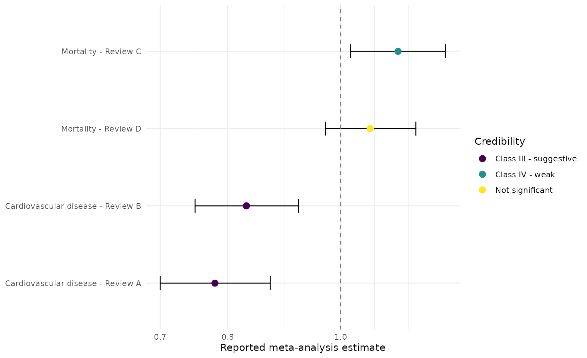
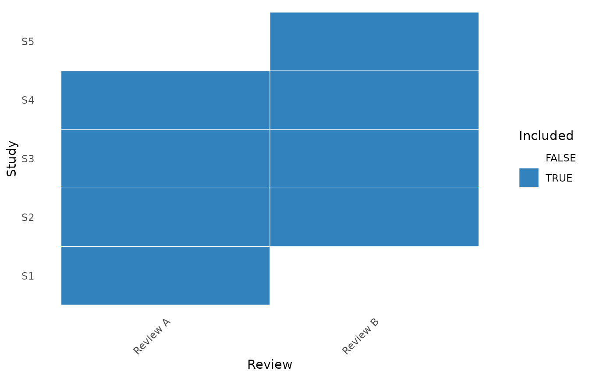
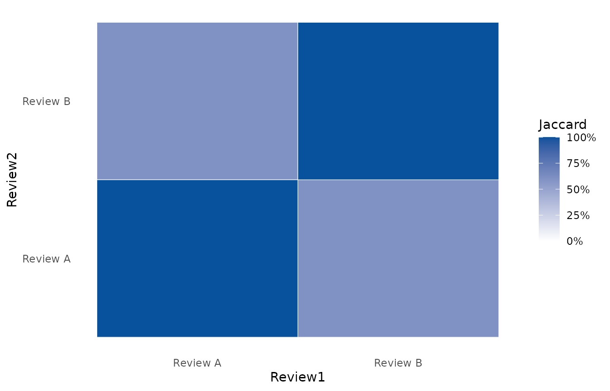
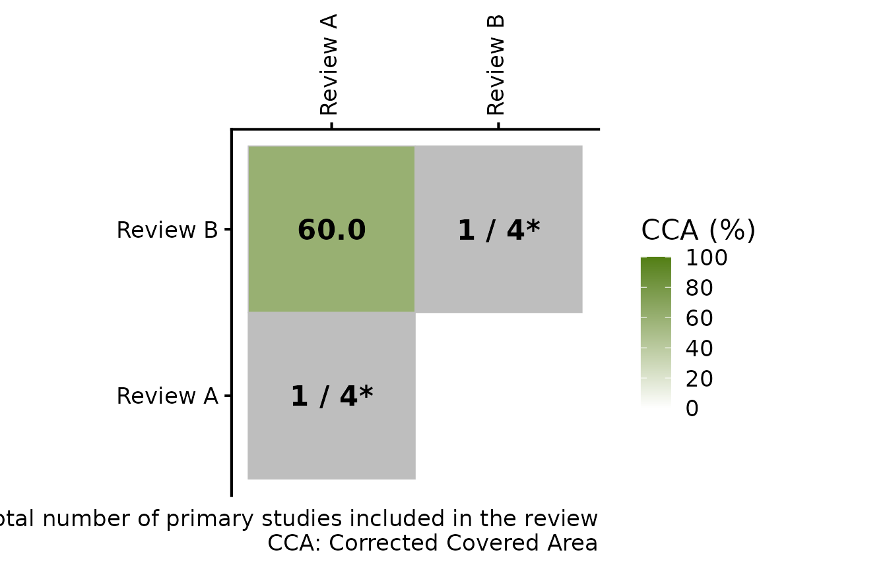
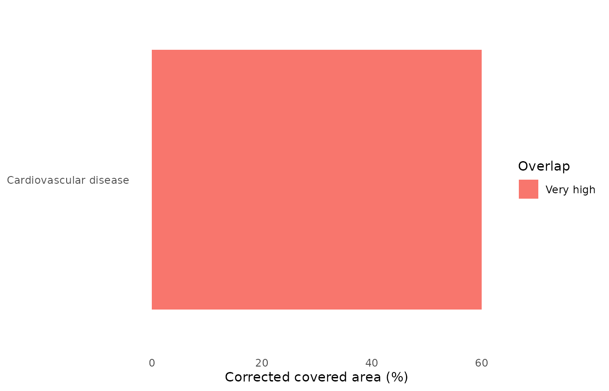

# Umbrella reviews without pooling meta-analyses

The umbrella-review functions preserve each published meta-analysis as a
separate result. They do not combine reviews into a new pooled estimate.

``` r

library(metapropul)

reviews <- data.frame(
  outcome = rep(c("Cardiovascular disease", "Mortality"), each = 2),
  review = c("Review A", "Review B", "Review C", "Review D"),
  estimate = c(0.78, 0.83, 1.12, 1.06),
  lower = c(0.70, 0.75, 1.02, 0.97),
  upper = c(0.87, 0.92, 1.23, 1.16),
  studies = c(14, 11, 8, 12),
  participants = c(3000, 2500, 1800, 2200),
  i2 = c(20, 45, 55, 40),
  p = c(1e-7, 2e-5, 0.01, 0.12),
  pred_lower = c(0.71, 0.69, 0.98, 0.94),
  pred_upper = c(0.88, 0.98, 1.28, 1.20),
  year = c(2022, 2024, 2020, 2025),
  quality = c("High", "Moderate", "Low", "High"),
  risk = c("Low", "Some concerns", "High", "Low")
)

umbrella <- umbrella_review(
  reviews, "outcome", "review", "estimate", "lower", "upper",
  studies = "studies", participants = "participants", i2 = "i2",
  p_value = "p", pred_lower = "pred_lower", pred_upper = "pred_upper",
  year = "year", quality = "quality",
  risk_of_bias = "risk"
)
umbrella
#> 
#> Umbrella review
#> ---------------
#> Systematic reviews/meta-analyses: 4 
#> Outcomes: 2 
#> Outcomes represented by multiple reviews: 2 
#> Effect scale: ratio
```

## Credibility, GRADE, and review quality

These are intentionally distinct assessments:

``` r

credibility <- classify_umbrella(umbrella)
grade <- grade_umbrella(
  umbrella, starting_certainty = "high",
  risk_of_bias = c("not_serious", "serious", "very_serious", "not_serious")
)
quality <- assess_review_quality(umbrella, tool = "AMSTAR2", overall = "quality")

credibility[, c("Outcome", "Review", "EvidenceClass")]
#> # A tibble: 4 × 3
#>   Outcome                Review   EvidenceClass         
#>   <chr>                  <chr>    <ord>                 
#> 1 Cardiovascular disease Review A Class III - suggestive
#> 2 Cardiovascular disease Review B Class III - suggestive
#> 3 Mortality              Review C Class IV - weak       
#> 4 Mortality              Review D Not significant
grade[, c("Outcome", "Review", "GRADE")]
#> # A tibble: 4 × 3
#>   Outcome                Review   GRADE   
#>   <chr>                  <chr>    <ord>   
#> 1 Cardiovascular disease Review A high    
#> 2 Cardiovascular disease Review B moderate
#> 3 Mortality              Review C low     
#> 4 Mortality              Review D high
quality
#> # A tibble: 4 × 4
#>   Outcome                Review   Tool    Overall 
#> * <chr>                  <chr>    <chr>   <chr>   
#> 1 Cardiovascular disease Review A AMSTAR2 High    
#> 2 Cardiovascular disease Review B AMSTAR2 Moderate
#> 3 Mortality              Review C AMSTAR2 Low     
#> 4 Mortality              Review D AMSTAR2 High
```

[`classify_umbrella()`](https://drrubesh.github.io/metapropul/reference/classify_umbrella.md)
applies quantitative credibility rules.
[`grade_umbrella()`](https://drrubesh.github.io/metapropul/reference/grade_umbrella.md)
records reviewer-supplied GRADE judgements; it does not infer GRADE
domains from statistical results.
[`assess_review_quality()`](https://drrubesh.github.io/metapropul/reference/assess_review_quality.md)
records AMSTAR 2 or ROBIS results.

``` r

render_gt(table_umbrella(umbrella, credibility, grade))
```

| Review | Reported estimate \[95% CI\] | Studies | Participants | I2 (%) | Conclusion | Credibility | GRADE |
|:---|:---|:---|:---|:---|:---|:---|:---|
| Cardiovascular disease |  |  |  |  |  |  |  |
| Review A | 0.780 \[0.700, 0.870\] | 14 | 3000 | 20 | Below null | Class III - suggestive | high |
| Review B | 0.830 \[0.750, 0.920\] | 11 | 2500 | 45 | Below null | Class III - suggestive | moderate |
| Mortality |  |  |  |  |  |  |  |
| Review C | 1.120 \[1.020, 1.230\] | 8 | 1800 | 55 | Above null | Class IV - weak | low |
| Review D | 1.060 \[0.970, 1.160\] | 12 | 2200 | 40 | No clear effect | Not significant | high |
| Each row is a reported meta-analysis result; no review-level pooling was performed. |  |  |  |  |  |  |  |

``` r

plot_umbrella(umbrella, credibility)
```



The plot contains one interval per reported meta-analysis and
deliberately has no pooled diamond.

## Diagnostics from primary studies

When primary-study estimates have been extracted, diagnostics are
calculated separately inside each source review. The example data below
are deterministic teaching values rather than a reconstruction of a
published review.

``` r

primary <- do.call(rbind, lapply(seq_len(nrow(reviews)), function(i) {
  se <- seq(0.10, 0.16, length.out = 5)
  centre <- log(reviews$estimate[i])
  yi <- centre + c(-0.08, -0.03, 0, 0.04, 0.09)
  data.frame(
    outcome = reviews$outcome[i], review = reviews$review[i],
    study = paste0(reviews$review[i], "-S", seq_along(se)),
    effect = exp(yi), lower = exp(yi - 1.96 * se),
    upper = exp(yi + 1.96 * se),
    participants = seq(400, 1200, length.out = 5)
  )
}))

primary_diagnostics <- diagnose_umbrella_primary(
  primary, "outcome", "review", "study", "effect", "lower", "upper",
  participants = "participants", min_egger = 3
)
primary_diagnostics$summary
#> # A tibble: 4 × 13
#>   Outcome       Review PrimaryStudies LargestStudy LargestEstimate LargestStudyP
#>   <chr>         <chr>           <int> <chr>                  <dbl>         <dbl>
#> 1 Cardiovascul… Revie…              5 Review A-S5            0.853         0.322
#> 2 Cardiovascul… Revie…              5 Review B-S5            0.908         0.547
#> 3 Mortality     Revie…              5 Review C-S5            1.23          0.204
#> 4 Mortality     Revie…              5 Review D-S5            1.16          0.354
#> # ℹ 7 more variables: SmallStudyZ <dbl>, SmallStudyP <dbl>,
#> #   SmallStudyAvailable <lgl>, ObservedSignificant <int>,
#> #   ExpectedSignificant <dbl>, ExcessSignificanceP <dbl>,
#> #   ExcessSignificance <lgl>
classify_umbrella(umbrella, primary_diagnostics)[,
  c("Outcome", "Review", "EvidenceClass")]
#> # A tibble: 4 × 3
#>   Outcome                Review   EvidenceClass         
#>   <chr>                  <chr>    <ord>                 
#> 1 Cardiovascular disease Review A Class III - suggestive
#> 2 Cardiovascular disease Review B Class III - suggestive
#> 3 Mortality              Review C Class IV - weak       
#> 4 Mortality              Review D Not significant
```

## Primary-study overlap

``` r

membership <- data.frame(
  outcome = rep("Cardiovascular disease", 8),
  review = rep(c("Review A", "Review B"), each = 4),
  study = c("S1", "S2", "S3", "S4", "S2", "S3", "S4", "S5")
)

overlap <- study_overlap(membership, "review", "study", "outcome")
overlap$overall
#> # A tibble: 1 × 8
#>   Outcome  Occurrences UniqueStudies Reviews StructuralMissing   CCA CCA.percent
#>   <chr>          <int>         <int>   <int>             <int> <dbl>       <dbl>
#> 1 Cardiov…           8             5       2                 0   0.6          60
#> # ℹ 1 more variable: Interpretation <chr>
overlap$pairwise
#> # A tibble: 1 × 12
#>   Outcome     Review1 Review2 Shared Union Occurrences Reviews StructuralMissing
#>   <chr>       <chr>   <chr>    <int> <int>       <int>   <int>             <int>
#> 1 Cardiovasc… Review… Review…      3     5           8       2                 0
#> # ℹ 4 more variables: Jaccard <dbl>, CCA <dbl>, CCA.percent <dbl>,
#> #   Overlap.minimum <dbl>
```

[`plot_study_overlap()`](https://drrubesh.github.io/metapropul/reference/plot_study_overlap.md)
displays the citation matrix, pairwise Jaccard overlap, or corrected
covered area.
[`sensitivity_umbrella_overlap()`](https://drrubesh.github.io/metapropul/reference/sensitivity_umbrella_overlap.md)
compares which reported review would be retained under prespecified
selection strategies; it does not pool the selected reviews.

``` r

plot_study_overlap(overlap, type = "citation_matrix")
```



``` r

plot_study_overlap(overlap, type = "jaccard")
```



``` r

plot_study_overlap(overlap, type = "cca")
```



The triangular CCA heatmap follows the convention used by `ccaR`:
pairwise CCA percentages appear below the diagonal, while grey diagonal
cells show the number of unique primary studies in each review. For
several outcomes, an overall summary bar plot is also available.

``` r

plot_study_overlap(overlap, type = "cca_summary")
```



## Review-selection sensitivity

Selection strategies choose one already reported result per outcome;
they do not calculate a synthesis across reviews.

``` r

sensitivity_umbrella_overlap(
  umbrella, overlap,
  strategies = c(
    "highest_quality", "lowest_risk_of_bias", "most_recent",
    "most_comprehensive", "largest_participant_count", "lowest_overlap",
    "user_selected"
  ),
  user_selected = c(
    "Cardiovascular disease" = "Review B",
    "Mortality" = "Review D"
  )
)[, c("Outcome", "Review", "Strategy", "Estimate")]
#> # A tibble: 14 × 4
#>    Outcome                Review   Strategy                  Estimate
#>    <chr>                  <chr>    <chr>                        <dbl>
#>  1 Cardiovascular disease Review A highest_quality               0.78
#>  2 Mortality              Review D highest_quality               1.06
#>  3 Cardiovascular disease Review A lowest_risk_of_bias           0.78
#>  4 Mortality              Review D lowest_risk_of_bias           1.06
#>  5 Cardiovascular disease Review B most_recent                   0.83
#>  6 Mortality              Review D most_recent                   1.06
#>  7 Cardiovascular disease Review A most_comprehensive            0.78
#>  8 Mortality              Review D most_comprehensive            1.06
#>  9 Cardiovascular disease Review A largest_participant_count     0.78
#> 10 Mortality              Review D largest_participant_count     1.06
#> 11 Cardiovascular disease Review B lowest_overlap                0.83
#> 12 Mortality              Review D lowest_overlap                1.06
#> 13 Cardiovascular disease Review B user_selected                 0.83
#> 14 Mortality              Review D user_selected                 1.06
```
